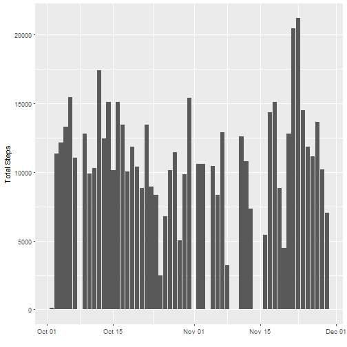
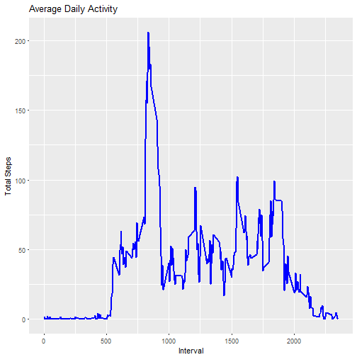
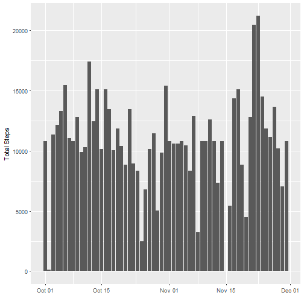
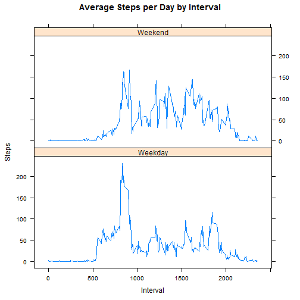

---
title: "Reproducible Research: Peer Assessment 1"
author: "Freddy Lazcano"
date: "December 14, 2016"
output: 
  html_document: 
    toc: yes
---   
 

## Loading and preprocessing the data
First we need to load the data and do any changes for our convinience when doing  analysis, and load the package ggplot2

```r
#install.packages("ggplot2")
library(ggplot2)

Dclass<- c('numeric','character','integer')
InitialData <- read.csv("activity.csv", header = TRUE, colClasses = Dclass, na.strings = "NA")
# Change date field 
InitialData$date <- as.Date(InitialData$date)

# Remove NA
ValidCount <- subset(InitialData, !is.na(InitialData$steps))
Stepsperday <- ValidCount[, c(1, 2)]
```

## What is mean total number of steps taken per day?
Next, we are going to make an histogram of total of steps taken each day, also find out what's the mean and median of steps taken each day. The total, mean and median of steps are shown in a single table

####Histogram


```r
graph1 <- ggplot(Stepsperday, aes(date, steps)) + geom_bar(stat = "identity") +
  scale_x_date() + xlab("") + ylab("Total Steps")
```



####Mean & Median


```r
TStepsperday <- aggregate(steps ~ date, Stepsperday, FUN = sum)
  Mean1 <-  mean(TStepsperday$steps)
  Median1 <- median(TStepsperday$steps)
```
The Mean Total for steps taken by day:

```
## [1] 10766.19
```

The Median Total for steps taken by day:

```
## [1] 10765
```

## What is the average daily activity pattern?

1. Make a time series plot (i.e. type = "l") of the 5-minute interval (x-axis)
and the average number of steps taken, averaged across all days (y-axis)
2. Which 5-minute interval, on average across all the days in the dataset,
contains the maximum number of steps?

####Time series plot


```r
Avg_per_int <-
  with(
    ValidCount[, c(1, 3)],
    aggregate(steps ~ interval, FUN = mean))
    
graph2 <- ggplot(Avg_per_int, aes(interval, steps)) + geom_line(size = 1, color = "blue") +
      xlab("Interval") + ylab("Total Steps") + ggtitle("Average Daily Activity" )
```



####5-min interval with more steps


```r
Avg_per_int[which.max(Avg_per_int$steps),]
```

```
##     interval    steps
## 104      835 206.1698
```

## Imputing missing values

1. Calculate and report the total number of missing values in the dataset
(i.e. the total number of rows with NAs)

2. Devise a strategy for filling in all of the missing values in the dataset. The
strategy does not need to be sophisticated. For example, you could use
the mean/median for that day, or the mean for that 5-minute interval, etc.

3. Create a new dataset that is equal to the original dataset but with the
missing data filled in.

4. Make a histogram of the total number of steps taken each day and Calculate
and report the mean and median total number of steps taken per day. Do
these values differ from the estimates from the first part of the assignment?
What is the impact of imputing


```r
## Calculate Mising values
sum(is.na(InitialData$steps))
```

```
## [1] 2304
```


```r
## Imputing missing valeus and create a new data set
All_wnas <- InitialData
nas <- is.na(All_wnas$steps)
avg <- tapply(ValidCount$steps, ValidCount$interval, mean, na.rm=TRUE, simplify=T)
All_wnas$steps[nas] <- avg[as.character(All_wnas$interval[nas])]

ValidCount2 <- subset(InitialData, !is.na(InitialData$steps))
Stepsperday2 <- All_wnas[, c(1, 2)]
```

####Histogram with NA's


```r
graph3 <- ggplot(Stepsperday2, aes(date, steps)) + geom_bar(stat = "identity") +
  scale_x_date() + xlab("") + ylab("Total Steps") 
```


#### Mean & Total with NA's


```r
TStepsperday2 <- aggregate(steps ~ date, Stepsperday, FUN = sum)
  Mean2 <-  mean(TStepsperday2$steps)
  Median2 <- median(TStepsperday2$steps)
```

The Mean Total for steps taken by day:

```
## [1] 10766.19
```

The Median Total for steps taken by day:

```
## [1] 10765
```

## Are there differences in activity patterns between weekdays and weekends?

1. Create a new factor variable in the dataset with two levels – “weekday”
and “weekend” indicating whether a given date is a weekday or weekend
day.

2. Make a panel plot containing a time series plot (i.e. type = "l") of the
5-minute interval (x-axis) and the average number of steps taken, averaged
across all weekday days or weekend days (y-axis). The plot should look
something like the following, which was creating using simulated data


```r
weekdays <- c("Monday", "Tuesday", "Wednesday", "Thursday", 
              "Friday")
All_wnas$dif = as.factor(ifelse
                             (is.element(weekdays(as.Date(All_wnas$date)),
                                         weekdays), 
                                            "Weekday", "Weekend")
                             )

TStepsperday3 <- aggregate(steps ~ interval + dif, All_wnas, mean)

library(lattice)

xyplot(TStepsperday3$steps ~ TStepsperday3$interval|TStepsperday3$dif,
       main="Average Steps per Day by Interval",
       xlab="Interval",
       ylab="Steps",
       layout=c(1,2), 
       type="l")
```



####Create .md file for github
knit(input="PA1_template.Rmd", output = "PA template.md")

